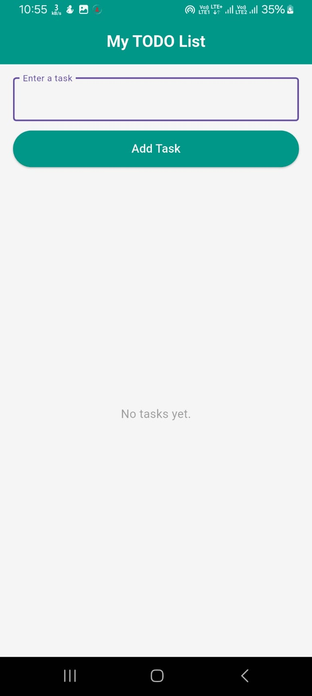
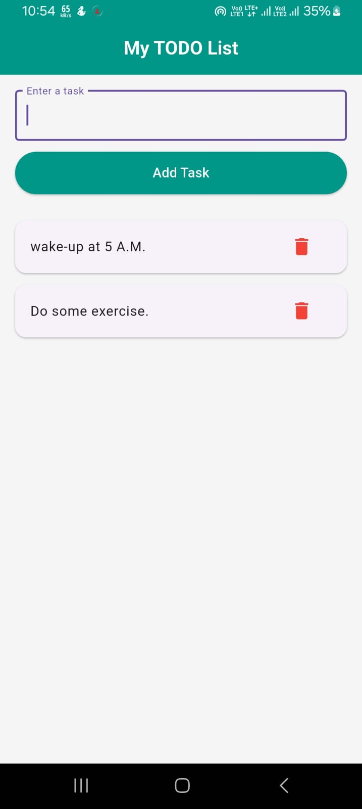

# 📝 Simple TODO App in Flutter

This is a **basic TODO app** built using Flutter. It allows users to add and remove tasks.  
It's perfect for beginners to understand Flutter UI, state management, and basic widgets.

---

## 🚀 Features

- Add new tasks 🟢
- Delete tasks ❌
- Beautiful minimal UI 💡
- Built using beginner-friendly Flutter code

---

## 📱 Screenshots

### 🧾 Home Screen



### 📝 Adding a Task



---

## 🎯 Tech Stack

- **Flutter** (UI framework)
- **Dart** (programming language)

---

## 🧠 What I Learned

- Flutter basics: `MaterialApp`, `Scaffold`, `TextField`, `ListView`
- State management using `setState()`
- Building simple UI layouts
- Text controllers and user input handling

---

## 🛠️ How to Run the App

1. Clone the repo:

```bash
git clone https://github.com/your-username/todo_flutter_app.git
```
